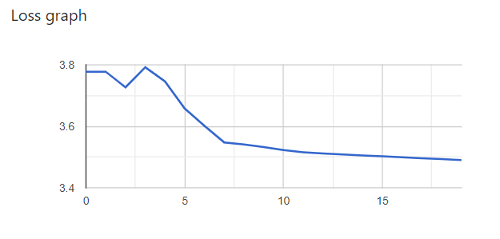
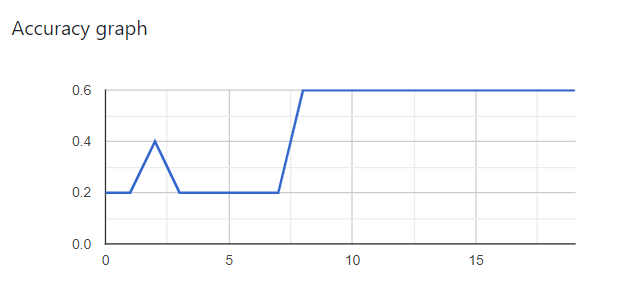

# Recurrent neural network implementation in Node.js

## About this repo

This example of a vanilla recurrent neural network shows how to make predictions on character-level. E.g. we will feed the network to predict the next char in the word 'hello' so if we will feed an 'h' the network has to guess what the next character could be. In this case it's 'e' of course! Moreover the RNN is using a dynamic learning rate, that decreases if the number of epochs increases.

This repository contains the logic and scripts that combine
two packages:
- [Tensorflow](https://www.tensorflow.org/) An end-to-end open source machine learning platform.
- [Google Charts](https://developers.google.com/chart) Platform for visualizing data

## Gallery

Visualisation of the networks loss:

Visualisation of the networks accuracy:

Maybe you can reach a loss less than me ;-)

### Install

1. Download this repo, run 'npm install' in the root directory
2. Build the project with 'npm run build'
3. Watch the project with 'npm run watch'(If your browser don't open automatically then you have to navigate to the URL that you will find in the console)
